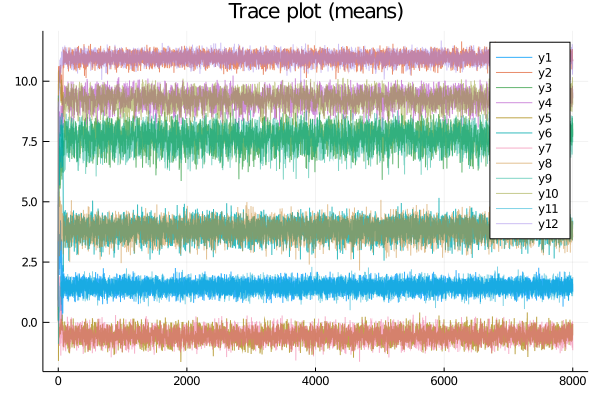

# Latent.jl

Latent.jl is a julia package that contains a variety of latent variable models. These models use either Expectation-Maximization or MCMC sampling or a mixture of both.

It currently contains an implementation of a Gaussian Mixture Model (GMM) used to cluster continuous data. It also contains an implementation of a time-homogenous and stationary Hidden Markov Model (HMM) for continuous univariate data.

## Installation

You can install the package through Julia's package manager:

```julia
>julia using Pkg
>julia Pkg.add(PackageSpec(url="https://github.com/JasperHG90/Latent.jl"))
```

## Examples

### Gaussian Mixture Model (GMM) using EM-estimation

The GMM clusters continuous data by decomposing a mixture of clusters into separate multivariate Gaussian distributions.

We can simulate such data as follows:

```julia
using Latent;

#=  
Create a dataset
This dataset will consist of three multivariate normal Distributions
And is used for the purposes of clustering using a GMM
=#

using Plots, Random 
Random.seed!(5236);

K = 3
N = [100 90 35];
μ = [1.8 9.0 -.3; 11.0 10.2 4.0];
Σ = cat([5. .6; .6 3.2], [4.2 3; 3 3.6], [3 2.2 ; 2.2 3], dims=K);

# Simulate dataset 
X, lbls = Latent.GMM.simulate(K, N, μ, Σ);

# Plot
plot(X[:,1], X[:,2], group=lbls, seriestype = :scatter, title = "GMM with 3 clusters")
```

</img>

To cluster the data using a GMM, we call `clust`:

```julia
# Number of clusters we think are in our dataset
K = 3;
# Retrieve labels and optim history
params, lblsp, history = Latent.GMM.clust(X, K; maxiter = 200, epochs = 150);
```

The `clust` function runs the EM algorithm several times (in this case 150 times). We can plot the loss for each of these epochs as follows:

```julia
# Plot history
Latent.GMM.plot_history(history)
```

</img>

We can also plot the clusters:

```julia
# Plot clusters
plot(X[:,1], X[:,2], group=lblsp, seriestype = :scatter, title = "GMM with 3 clusters (estimated)")
```

</img>

### GMM using MCMC sampling

We can also use MCMC sampling instead of the EM-algorithm to obtain the posterior distributions. 

Using the same generated data as we did in the previous example, we first need to specify the following hyperpriors:

```julia
## Hyperpriors
using LinearAlgebra
N, M = size(X)
# Prior means 
κ0 = zeros((size(X)[2], K))
# Prior covariance matrix 
T0 = zeros((M, M, K))
for k ∈ 1:K
    T0[:,:,k] = Matrix(I, (M,M))
end;
# Hypothesized number of subjects in each group 
ν0 = ones(Int64, (K)) .+ 1
# Hypothesized prior sums-of-squares matrix 
Ψ0 = T0
# Hypothesized number of subjects 
α0 = [1, 1, 1]
```

We can now call the MCMC sampler:

```julia
# Sample the posterior distributions
history = Latent.BGMM.gibbs_sampler(X, K, α0, κ0, Τ0, ν0, Ψ0; iterations=5000);
```

We can now inspect the trace plots:

```julia
# Specify burn-in samples
burnin = 2000
# Get means 

# Get MCMC history for means.
# (chains x iterations x variables x clusters)
μ_h = history[1];
μ_h1 = reshape(μ_h[1,:,:,:],(size(μ_h)[2], size(μ_h)[3] * size(μ_h)[4])) # Chain 1 
μ_h2 = reshape(μ_h[2,:,:,:],(size(μ_h)[2], size(μ_h)[3] * size(μ_h)[4])) # Chain 2
```

```julia
julia> mapslices(mean, μ_h1, dims=[1])
1×6 Array{Float64,2}:
 7.92874  9.28638  1.62668  10.7877  -0.535033  4.00717

julia> mapslices(mean, μ_h2, dims=[1])
1×6 Array{Float64,2}:
 8.01656  9.36826  -0.588281  3.94625  1.64997  10.7903
```

```julia
# Plot clusters
plot(μ_h1, alpha=0.8, title="Trace plot (means)")
plot!(μ_h2, alpha=0.5)
```

</img>

After establishing that the clusters have converged, we can inspect the *Maximum A Posteriori* (MAP) estimates:

```julia
# Obtain MAP estimates
# (use only chain 1)

# Means (chains x iterations x variables x clusters)
μ_MAP = mapslices(mean, history[1][1,burnin:end,:,:], dims=[1]) |> x -> reshape(x, size(μ))
# Covariance matrix (Chains x iterations x variables x variables x clusters)
Σ_MAP = mapslices(mean, history[2][1,burnin:end,:,:,:], dims=[1]) |> x -> reshape(x, size(Σ))
# Mixing proportions (Chains x iterations x K)
ζ_MAP = mapslices(mean, history[3][1,burnin:end,:], dims=[1]) |> x -> reshape(x, size(x) |> reverse)

# Get cluster assignments
clstrs = Latent.BGMM.cluster_assignments(X, ζ_MAP, μ_MAP, Σ_MAP)

# Plot
plot(X[:,1], X[:,2], group=clstrs, seriestype = :scatter, title = "GMM with 3 clusters")
```

</img>

Compared to EM estimation, Bayesian inference may seem like a chore. However, it offers many benefits in that Bayesian methods can update their parameters by using Bayesian updating. Bayesian inference also automatically yields [uncertainty estimates](https://en.wikipedia.org/wiki/Credible_interval) that are easier to interpret than their Frequentist counterparts.
