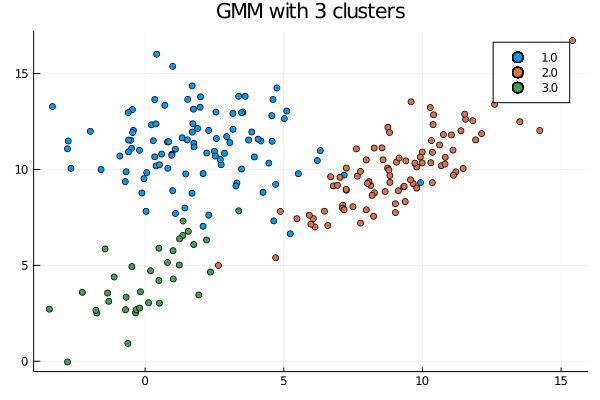
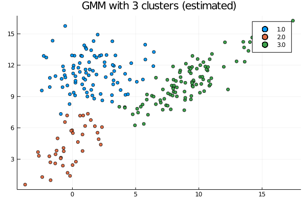

# Latent.jl

Latent.jl is a julia package that contains a variety of latent variable models. These models use either Expectation-Maximization or MCMC sampling.

It currently contains an implementation of a Gaussian Mixture Model (GMM) used to cluster continuous data. A future version of the package will also contain an implementation of a Hidden Markov Model (HMM) by means of full posterior sampling.

## Installation

You can install the package through Julia's package manager:

```julia
>julia using Pkg
>julia Pkg.add(PackageSpec(url="https://github.com/JasperHG90/Latent.jl"))
```

## Examples

### Gaussian Mixture Model (GMM)

The GMM clusters continuous data by decomposing a mixture of clusters into separate multivariate Gaussian distributions.

We can simulate such data as follows:

```julia
using Latent;

#=  
Create a dataset
This dataset will consist of three multivariate normal Distributions
And is used for the purposes of clustering using a GMM
=#

using Plots, Random 
Random.seed!(5236);

K = 3
N = [100 90 35];
μ = [1.8 11.; 9.0 10.2 ; -.3 4.];
Σ = cat([5. .6; .6 3.2], [4.2 3; 3 3.6], [3 2.2 ; 2.2 3], dims=K);

# Simulate dataset 
X, lbls = Latent.GMM.simulate_GMM(K, N, μ, Σ);

# Plot
plot(X[:,1], X[:,2], group=lbls, seriestype = :scatter, title = "GMM with 3 clusters")
```

</img>

To cluster the data using a GMM, we simply call `clust`:

```julia
# Number of clusters we think are in our dataset
K = 3;

# Retrieve labels and optim history
lblsp, history = Latent.GMM.clust(X, K; maxiter = 200, epochs = 150);
```

The `clust` function runs the EM algorithm several times (in this case 150 times). We can plot the loss for each of these epochs as follows:

```julia
# Plot history
Latent.GMM.plot_history(history)
```

</img>

We can also plot the clusters:

</img>
